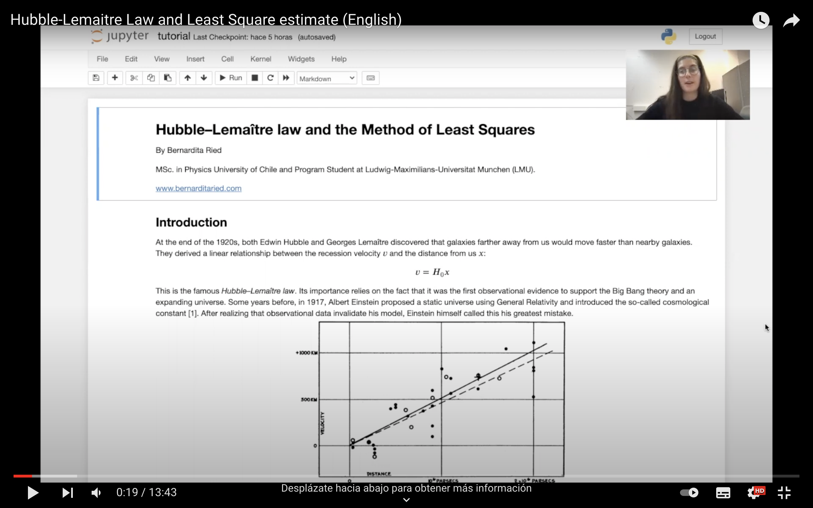

Hi!

I recorded myself and did a tutorial about the Hubble-Lemaitre Law and Least Square estimate.

At the end of the 1920s, both Edwin Hubble and Georges Lemaître discovered that galaxies farther away from us would move faster than nearby galaxies. They derived a linear relationship between the recession velocity and the distance from us.

This is the famous Hubble–Lemaître law. Its importance relies on the fact that it was the first observational evidence to support the Big Bang theory and an expanding universe.

Nowadays, the estimated value for Hubble constant differs in a factor of 9 and 7 to the ones found by Lemaître and Hubble, respectively. This discovery changed our conception of the universe.

Hubble used a least square linear regression on 24 measurements of distances and recessional velocities of galaxies. In this tutorial, we will reproduce those results and introduce the least squares method.

[I invite you to see the code at my Github page!](https://github.com/bernarditaried/Hubble-Lemaitre-Law)
