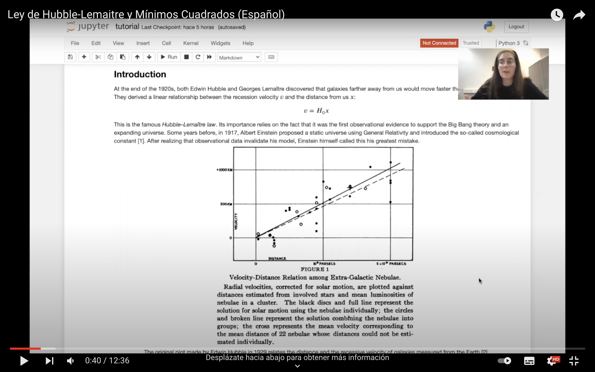

A finales de la década de 1920, tanto Edwin Hubble como Georges Lemaître descubrieron que las galaxias más lejanas de nosotros se movían más rápido que las galaxias cercanas. Obtuvieron una relación lineal entre la velocidad de recesión y la distancia a nosotros.

Esta es la famosa ley de Hubble-Lemaître. Su importancia radica en que fue la primera evidencia observacional que apoyó la teoría del Big Bang y un universo en expansión.

Hoy en día, el valor estimado de la constante de Hubble difiere en un factor de 9 y 7 a los encontrados por Lemaître y Hubble, respectivamente. Este descubrimiento cambió nuestra concepción del universo.

Hubble utilizó una regresión lineal de mínimos cuadrados sobre 24 mediciones de distancias y velocidades de recesión de galaxias. En este tutorial, reproduciremos esos resultados y presentaremos el método de los mínimos cuadrados.

[¡Te invito a ver mi código en mi página de Github!](https://github.com/bernarditaried/Hubble-Lemaitre-Law)
